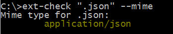

# ext-check

> Check and fix extensions before importing into Qlik Sense Server.

[](https://codeship.com/projects/104851)

[](https://github.com/stefanwalther/ext-check)

## About

ext-check is a NodeJS based command line tool which was primarily developed to solve a degrade in Qlik Sense 2.1.1 which prevents extensions containing specific files from being uploaded to Qlik Sense server.

The following scenarios are supported:

* Check a zip file whether it will likely work in Qlik Sense server or not
* List all file-types in a zip file
* List all files for a given file-type in a zip file
* Fix a zip file and remove all files which are not working in the official Qlik Sense 2.1.1 release

## Prerequisites

[Node.js](https://nodejs.org) + NPM installed on your system.

## Install

Install the tool globally.

```bash
npm install ext-check -g  
```

## Run

Run `ext-check` in the command line using one of the following options:

## Options
* **`--help`** (alias `-h`) - Show the help
* **`--list`** (alias `-l`) - List all file-extensions and their usage count in the given zip file
* **`--listdir`** (alias `-ldir`) - List all file-extensions in a directory, grouped by zip file
* **`--listdetails`** (alias `-ld`) - List all files where a specific file extension is used
* **`--fix`** (alias `-f`) - Whether to fix the file or not (defaults to `false`) -- NOT WORKING YET
* **`--backup`** (alias `-b`) - Whether to create a backup or not (defaults to `true`)

## Usage Examples

**Just check**

Just check the visualization extension, the output in the command line will indicate if there is a problem which needs to be fixed.

```bash
ext-check "myExtension.zip"
or 
ext-check "c:\MyExtensions\myExtension.zip"
```

**List file-extensions used**

```bash
ext-check "myExtension.zip" --list
or
ext-check "myExtension.zip" -l
```

**List file-extensions used for each zip file in a directory**

```bash
ext-check "myExtension.zip" --listdir
or 
ext-check "myExtension.zip" -ldir
```

**List all files for a specific file extension**

```bash
ext-check "myExtension.zip" --listdetails=".json"
or 
ext-check "myExtension.zip" --ld=".json"
```

**Check and fix**

Checks the extension, fixes potential problems in the source zip-file (create a backup with %filename%.bak before) immediately.

```bash
ext-check "myExtension.zip" --fix
```

**Check and fix, no backup**

```bash
ext-check "myExtension.zip" --fix --backup=false
```

**Get the MIME type for a file extension**

```bash
ext-check ".json" --mime
```

> [](https://nodejs.org)

## Known limitations

* Currently the tool is developed especially to validate scenarios around Qlik Sense 2.1.1 (but this might change in the future)
* Password protected zip files are currently not supported

## Contribution

Pull requests and stars are always welcome. For bugs and feature requests, [please create an issue](https://github.com/stefanwalther/ext-check/issues).
The process for contributing is outlined below:

1. Create a fork of the project
2. Work on whatever bug or feature you wish
3. Create a pull request (PR)

I cannot guarantee that I will merge all PRs but I will definitely evaluate them all.

## Author

**Stefan Walther**

+ [qliksite.io](http://qliksite.io)
* [twitter/waltherstefan](http://twitter.com/waltherstefan)
* [github.com/stefanwalther](http://github.com/stefanwalther)

## License

Released under the MIT license.

***

_This file was generated by [verb-cli](https://github.com/assemble/verb-cli) on October 14, 2015._